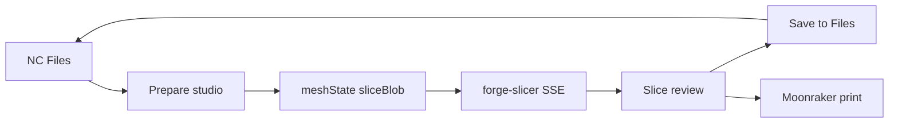

> **COMPLETED (historical).** This v1.4→v1.7 roadmap shipped in full. Later work
> (self-contained slicer, 3D toolpath, supports, arrange, calibration, pauses,
> surface-quality overrides) is tracked in [`CHANGELOG.md`](../../CHANGELOG.md)
> and [`docs/plans/nc-print-self-contained-slicer.md`](nc-print-self-contained-slicer.md).

# NC Print — UX & Feature Roadmap (refocused, v1.4 → v1.7)

## North star

**One sentence:** An operator opens a model from Nextcloud Files, prepares it on a bed they trust, slices with visible settings and toolpaths, saves G-code beside the source file, and prints with live feedback — without opening Orca except for exotic tuning.

## Refocus priorities (P0 → P4)

| Priority | Theme | Why first |
|----------|-------|-----------|
| **P0** | WYSIWYG mesh (preview = slice input) | #1 trust bug today |
| **P1** | Prepare studio layout (3-column, viewport-centric) | #1 UX complaint |
| **P2** | Mesh health + orient + supports + multi-plate 3MF | Operator-confirmed prep toolbox |
| **P3** | Slice review + Files-native G-code + history | Nextcloud workflow completion |
| **P4** | Print monitoring (WS, estimate vs actual, multi-printer) | Lab ops at scale |

## Operator-confirmed scope (2026-06-30)

The following were previously listed as out-of-scope; **all are now in scope** at the stated depth (not full Orca desktop):

| Area | In scope | Depth |
|------|----------|-------|
| Support material | Yes | Enable/type/threshold + brim/raft/skirt overrides; post-slice support mass/time |
| Auto-orient | Yes | 6 axis-aligned rotations (Forge `stl-analyzer` logic); updates meshState |
| Mesh repair / analyze | Yes | Analyze → warn → one-click repair via forge `/api/mesh/*` (proxy) |
| Multi-plate / multi-object 3MF | Yes | Picker for build items; v1 combined STL, v1.7 optional batch jobs |
| Profile editing | Yes | Quick-edit **form** (15+ params) + local named presets; not raw YAML |
| Multi-tool / multi-material | Yes | Per-tool filament dropdowns; no paint-on-mesh |
| Tablet layout | Yes | 1024px pass (touch targets, collapsible columns); desktop remains primary |
| Advanced Orca (fuzzy skin, seam paint) | Partial | Read-only in profile snapshot + Orca wiki links; simple scalar overrides if forge accepts them in v1.7 |

**Still excluded:** seam/fuzzy **region painting**, modifier meshes / CSG, multi-plate **arrange/nesting** editor, phone-first UX, raw YAML editor.

---

## Current state (v1.3.5)

| Shipped | Gap |
|---------|-----|
| Z-up viewport, 3MF→STL preview+slice, Prepare overrides, rotate toolbar, SSE fix | Layout still vertical stack |
| Profiles, slice, print, Files open-in-app | Viewport transform ≠ slice file |
| Checklist, workflow banner | Mesh/orient/repair/supports not exposed |
| | No save G-code to Files, no history |
| | Proxy only documents `slice/stream`; `/api/mesh/*` not wired in UI |

Key files: [`PrepareTab.vue`](media/4TB/nc-print/src/components/PrepareTab.vue), [`print.js`](media/4TB/nc-print/src/store/print.js), [`SlicerProxyController.php`](media/4TB/nc-print/lib/Controller/SlicerProxyController.php), [`mesh-convert.js`](media/4TB/nc-print/src/services/mesh-convert.js).



---

## Sprint 0 — API audit & plan check-in (before Sprint A)

**Goal:** No frontend work on mesh APIs until upstream paths are verified on `forge-slicer` (:8766).

| Task | Owner | Output |
|------|-------|--------|
| `curl` probe `/api/mesh/analyze`, `/api/mesh/repair`, `/api/jobs`, `/api/preview` | Agent | `docs/plans/forge-slicer-api-audit.md` |
| Extend [`SlicerProxyController.php`](media/4TB/nc-print/lib/Controller/SlicerProxyController.php) route map if paths exist | Agent | Proxy tests in PHPUnit |
| Copy this plan to [`docs/plans/nc-print-ux-roadmap.md`](media/4TB/nc-print/docs/plans/nc-print-ux-roadmap.md) | Agent | Checked-in plan per workflow |
| Map backlog IDs C1–C6 → sprint rows | Agent | Update [`FEATURE_PORT.md`](media/4TB/nc-print/docs/FEATURE_PORT.md) |

**Acceptance:** Audit doc lists which endpoints return 200 on lab forge-slicer; gaps have client-fallback or Sprint J deferral noted.

---

## Feature tiers (consolidated)

### Tier 1 — Studio shell (Sprint A)

| ID | Feature | Acceptance criteria |
|----|---------|---------------------|
| 1.1 | 3-column Prepare ≥1200px | Profiles+overrides left; viewport center min 480px; checklist+CTA right |
| 1.2 | Clickable checklist | Each ✗ row focuses/opens fix control |
| 1.3 | Slice summary card | Shows slice filename, bbox, fits-bed, dirty badge |
| 1.4 | Merge job strip into workflow banner | Single status row when healthy |
| 1.6 | First-run empty state | Import + From Files + 3-step diagram |
| 1.7 | Profile search / last-used | Filter on long dropdowns; prefs pin recent trio |
| 1.8 | View presets + bed toggle | Top/Front/Iso/Bed camera; grid label with bed mm |

**New/ touched components:** `PrepareStudioLayout.vue` (wrapper), `SliceSummaryCard.vue`, refactor [`PrepareTab.vue`](media/4TB/nc-print/src/components/PrepareTab.vue).

### Tier 2 — Mesh truth (Sprint B)

| ID | Feature | Acceptance criteria |
|----|---------|---------------------|
| 2.1 | meshState + WYSIWYG | Rotate/center changes slice STL; Apply + auto-apply option |
| 2.2 | Session persistence | Reload same fileId restores profiles + transform + last job_id |

**Store shape:**

```text
meshState: {
  sourceFile, position[3], rotation[3], scale,
  sliceBlob: File, dirty: bool, appliedAt: ISO
}
```

**Tests:** Vitest for dirty flag, slice file selection, prefs round-trip.

### Tier 2 — Prep toolbox (Sprint C)

| ID | Feature | Acceptance criteria |
|----|---------|---------------------|
| 1.5 | Lay flat + scale-to-fit | Buttons update viewport + meshState |
| 2.5 | OBJ preview + slice | OBJLoader + OBJ→STL like 3MF |
| 2.9 | Mesh analyze & repair | Panel shows open edges; Repair updates sliceBlob; checklist row |
| 2.10 | Auto-orient | Best of 6 rotations; overhang % before/after in summary |
| 2.11 | Support + adhesion overrides | enable_support, type, threshold, brim, raft; passed in `buildSliceOverrides` |
| 2.12 | Multi-object 3MF picker | Checkbox list when build has >1 printable item |
| 2.8 | Recent models strip | Last 5 paths, click reload |

**Override keys to add** in [`slicer-utils.js`](media/4TB/nc-print/src/services/slicer-utils.js):

`enable_support`, `support_type`, `support_threshold`, `brim_width`, `raft_layers`, `skirt_loops` (names must match forge/Orca profile JSON keys — confirm in Sprint 0 audit).

**New components:** `MeshHealthPanel.vue`, `ThreeMfObjectPicker.vue`, `mesh-api.js` (client for proxied `/api/mesh/*`).

**Fallback:** If forge mesh API missing, port minimal `analyzeMesh` + orientation from [`mesh-repair.js`](media/4TB/3dprintforge/src/server/mesh-repair.js) / [`stl-analyzer.js`](media/4TB/3dprintforge/src/server/stl-analyzer.js) to browser (same as 3MF parser approach).

### Tier 2 — Slice confidence (Sprint D)

| ID | Feature | Maps backlog |
|----|---------|--------------|
| 2.3 | Settings diff review panel | — |
| 2.4 | Tabbed results (Summary / Toolpath / G-code / Settings) | C3 lightbox in Toolpath tab |
| 2.7 | Slice now on Prepare | — |
| — | Pre-print modal before Slice & Send | C2 |
| — | Support material stats on SliceResultPanel | Scope review |

**Acceptance:** Operator sees override diff before slice; PNG full-screen; modal blocks Slice & Send until acknowledged.

### Tier 3 — Files & history (Sprint E)

| ID | Feature | Backend work |
|----|---------|--------------|
| 3.1 | Save G-code to Files | **New** [`GcodeSaveController.php`](media/4TB/nc-print/lib/Controller/) or extend Files API — WebDAV PUT sibling `{stem}.gcode` |
| 3.2 | Job history (local 20 rows) | Pinia + localStorage; optional forge `/api/jobs` enrich |
| 4.6 | Files integration | Context menu polish, open folder after save |

**Acceptance:** After slice, Save to Files creates sibling; visible in NC Files without download/upload dance.

### Tier 3 — Visual verification (Sprint F)

| ID | Feature | Maps backlog |
|----|---------|--------------|
| 3.4 | G-code layer scrubber (canvas 2D) | C6 phase 1 |
| 3.5 | Split workspace right rail | C1 |
| — | Probe `POST /api/preview` | Deferred → Sprint J if 501 |

**Acceptance:** Layer slider scrubs toolpath; rail shows camera on Prepare, mini preview on Slice.

### Tier 3 — Lab ops (Sprint G)

| ID | Feature |
|----|---------|
| 3.3 | Multi-printer Moonraker picker (admin config JSON) |
| 3.6 | Local named presets + forge `POST /api/profiles` when unblocked |
| 3.7 | Moonraker WebSocket client (progress, state, messages) |
| 3.8 | Estimate vs actual on Print tab | C5 |

### Tier 3 — Advanced prep (Sprint I)

| ID | Feature |
|----|---------|
| 3.9 | Profile quick-edit: cooling, retraction summary, adhesion block |
| 3.10 | Multi-tool filament slots (T0, T1, …) |
| 3.11 | Tablet 1024px layout pass |

### Tier 4 — Polish (Sprint H, parallelizable)

4.1 shortcuts · 4.2 SSE stage copy · 4.3 error recovery cards · 4.4 draggable camera PiP · 4.5 admin onboarding · 4.7 a11y

### Tier 5 — Upstream-dependent (Sprint J, v1.7.x)

| Item | Blocker | When unblocked |
|------|---------|----------------|
| Save Quality preset to forge DB | `POST /api/profiles` | Wire PrepareOverrides save button |
| Batch slice per 3MF object | forge batch API or N sequential jobs | Multi-select picker → queue |
| Server 3D toolpath preview | `POST /api/preview` ≠ 501 | Replace 2D scrubber or augment |
| Simple fuzzy/seam scalars | forge override keys documented | Add to quick-edit if safe |

---

## Backend & proxy gap fill (cross-cutting)

Not optional — several UX items **require PHP/proxy work**:

| Work | Sprint | File(s) |
|------|--------|---------|
| Proxy `api/mesh/analyze`, `api/mesh/repair`, `api/mesh/transform` | 0/C | [`SlicerProxyController.php`](media/4TB/nc-print/lib/Controller/SlicerProxyController.php) |
| Save G-code WebDAV endpoint | E | New controller + route in [`appinfo/routes.php`](media/4TB/nc-print/appinfo/routes.php) |
| Multi-printer config in Admin | G | NC Print admin settings UI / config schema |
| Moonraker WS (browser connects via same-origin proxy or direct LAN) | G | Evaluate CORS; may need [`MoonrakerProxyController`](media/4TB/nc-print/lib/Controller/) WS shim |

---

## Component map (new Vue modules)

| Component | Sprint | Purpose |
|-----------|--------|---------|
| `PrepareStudioLayout.vue` | A | 3-column grid + responsive collapse |
| `SliceSummaryCard.vue` | A | What will slice / dirty state |
| `MeshHealthPanel.vue` | C | Analyze + repair + overhang hint |
| `ThreeMfObjectPicker.vue` | C | Multi-object 3MF selection |
| `SliceReviewPanel.vue` | D | Override diff before slice |
| `SliceResultTabs.vue` | D | Tabbed Summary/Toolpath/G-code/Settings |
| `PrePrintModal.vue` | D | Warn-only before Slice & Send |
| `JobHistoryPanel.vue` | E | Recent jobs list |
| `ToolpathScrubber.vue` | F | Canvas layer viewer |
| `WorkspaceRail.vue` | F | Persistent right column |
| `ProfileQuickEdit.vue` | I | Extended override sections |
| `MultiToolFilamentPicker.vue` | I | T0/T1 filament selects |

Extend existing: [`PrepareOverrides.vue`](media/4TB/nc-print/src/components/PrepareOverrides.vue), [`ViewportToolbar.vue`](media/4TB/nc-print/src/components/ViewportToolbar.vue), [`print.js`](media/4TB/nc-print/src/store/print.js).

---

## Sprint schedule (refocused)

| Sprint | Version | P | Deliverables |
|--------|---------|---|--------------|
| **0** | — | — | API audit, proxy map, checked-in plan |
| **A** | 1.4.0 | P1 | Studio layout, summary card, checklist actions, chrome merge, empty state, profile search |
| **B** | 1.4.1 | P0 | meshState, Apply/auto-apply, session restore |
| **C** | 1.4.2 | P2 | Lay flat, scale, OBJ, mesh analyze/repair, auto-orient, supports, 3MF picker, recent |
| **D** | 1.5.0 | P3 | Review diff, tabbed results, pre-print modal, lightbox, support stats |
| **E** | 1.5.1 | P3 | Save G-code PHP+UI, history, Files polish |
| **F** | 1.5.2 | P3 | Layer scrubber, workspace rail |
| **G** | 1.6.0 | P4 | Multi-printer, presets, Moonraker WS, estimate vs actual |
| **H** | 1.6.x | — | Shortcuts, errors, camera overlay, a11y, admin |
| **I** | 1.6.x | P2 | Quick-edit, multi-tool, tablet layout |
| **J** | 1.7.x | — | Upstream-unblocked items only |

**Dependency chain:**

```text
Sprint 0 → C (mesh API)
Sprint B (2.1) → C (2.10 orient), B (2.2 restore transform)
Sprint B → D (review knows meshState)
Sprint E (3.1 save) → E (3.2 history links)
Sprint G (3.7 WS) → G (3.8 estimate vs actual)
```

---

## Risk register

| Risk | Mitigation |
|------|------------|
| forge-slicer lacks `/api/mesh/*` on :8766 | Sprint 0 audit; browser port fallback |
| Override keys don’t match Orca | Audit merged profile JSON; map in `slicer-utils` with tests |
| Save G-code DAV permissions | Use authenticated user's folder; same path as model source |
| Moonraker WS CORS | Proxy or LAN-only direct URL in admin config |
| Bundle size (Three.js + toolpath) | Lazy chunks: `nc-print-three`, `nc-print-toolpath` |
| meshState export slow on huge STL | Debounce 500ms; web worker for STL encode in v1.5 if needed |

---

## Verification matrix

| Sprint | Automated | Manual |
|--------|-----------|--------|
| 0 | Proxy PHPUnit for new routes | `curl` audit sheet |
| A | CSS class / layout smoke test | 1280 + 1920 Prepare screenshot |
| B | meshState vitest | Rotate → slice → PNG orientation |
| C | mesh-convert + override vitest | Broken STL repair; multi-object 3MF; support toggle changes G-code |
| D | — | Pre-print modal; tabbed results; lightbox |
| E | PHP unit for save path | G-code sibling in Files |
| F | G-code parser tests | Layer scrubber drag |
| G | WS mock test | Print progress live; multi-printer send |
| H | a11y lint spot-check | Keyboard shortcuts |
| I | multi-tool slice payload test | Tablet 1024 layout |

**Every sprint:** `make gate-preflight`, version bump, CHANGELOG, `make deploy`, update FEATURE_PORT coverage %.

**Manual E2E:** NS12.15–NS12.18 from [`docs/VERIFY.md`](media/4TB/nc-print/docs/VERIFY.md) after Sprint D.

---

## Success metrics

| Metric | Target |
|--------|--------|
| Prepare scroll depth to reach viewport | ≤0 on desktop (viewport visible without scroll) |
| Slice orientation matches preview | 100% on test STL after Sprint B |
| 3MF multi-object | Operator can exclude plates before slice |
| G-code in Files | ≥1 click save after slice (Sprint E) |
| Re-slice same part | <30s to ready via history/recent (Sprint E) |
| Print progress latency | <2s via WS (Sprint G) |

---

## Out of scope (final, narrow)

- Seam painting, fuzzy-skin **region painting**, painted supports on mesh
- Modifier meshes, CSG, negative volumes in browser
- Multi-plate **arrange/nesting** editor (manual layout on bed)
- Raw profile YAML / JSON editor in NC Print
- Phone-first dedicated flows (<768px)
- Full Orca desktop replacement

---

## Execution note

When implementation starts: check in this file at [`docs/plans/nc-print-ux-roadmap.md`](media/4TB/nc-print/docs/plans/nc-print-ux-roadmap.md), begin **Sprint 0** then **Sprint A**, one sprint per release unless hotfix needed.
